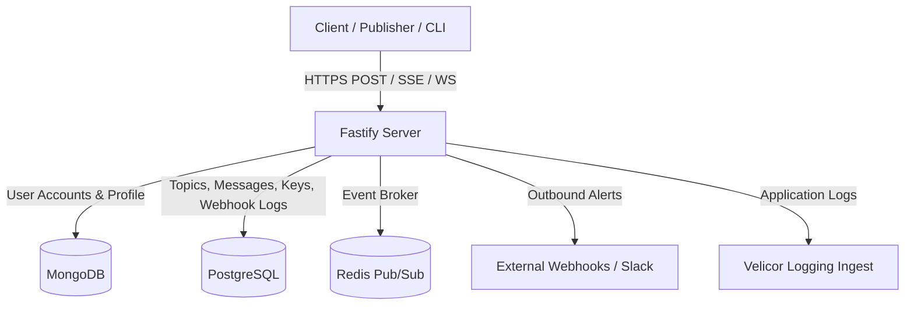

# 📡 Beacon Server

Beacon is a lightweight, high-performance real-time event router, telemetry ingestion server, and message broker. It allows developers to register topics, ingest telemetry streams, and subscribe to events via Server-Sent Events (SSE) or WebSockets in real time. It is designed to act as the backbone for notifications, logs, and audit logs.

---

## ✨ Features

- **Real-Time Streams**: Stream payloads to clients instantly using WebSockets (WS) or Server-Sent Events (SSE).
- **Dual-Database Architecture**:
  - **MongoDB**: Used for managing user accounts, passwords (hashed with bcrypt), and global account profiles.
  - **PostgreSQL**: Used for high-volume transactions, indexing topic metadata, message history, API keys, and webhook delivery logs.
- **Scalable Event Broker**: Automatically shifts from a single-process memory event broker to a horizontally scalable Redis Pub/Sub broker when a Redis URL is provided.
- **Dynamic Payload Validation**: Supports registering a JSON Schema (`ajv`) per topic to validate and reject malformed ingestion requests before they are saved.
- **Outbound Webhooks with Retry Backoff**: Configure webhooks per topic to dispatch incoming messages to external URLs (e.g. Slack/Discord) with an automatic 3-attempt exponential backoff mechanism.
- **Robust Authentication Options**: Secure endpoints using JWT or granular API keys:
  - Account API keys (`bc_...`) for admin access.
  - Topic-specific API keys (`bt_...`) with scope restrictions (`publish`, `subscribe`, `all`).
- **Telemetry-Aware Logging**: Integrates custom Pino streams to batch-upload server warnings and error logs to a Velicor telemetry ingestion platform.

---

## 🛠️ Architecture

Beacon utilizes a hybrid storage model to leverage the strengths of document and relational databases.



Key configuration files include:
- [src/server.js](file:///home/sid/Documents/GitHub/Beacon/src/server.js): Entry point initializing Fastify, CORS, JWT authentication hooks, rate-limiting, and database hookups.
- [src/routes.js](file:///home/sid/Documents/GitHub/Beacon/src/routes.js): Contains core topic registration, message publishing, SSE/WS streaming, and analytics endpoints.
- [src/authRoutes.js](file:///home/sid/Documents/GitHub/Beacon/src/authRoutes.js): Core user registration, login session generation, and API key reset endpoints.
- [src/broker.js](file:///home/sid/Documents/GitHub/Beacon/src/broker.js): The pub-sub event orchestrator routing messages locally or through Redis.
- [src/db.js](file:///home/sid/Documents/GitHub/Beacon/src/db.js): PostgreSQL connection manager and automated database migration schemas.
- [src/webhooks.js](file:///home/sid/Documents/GitHub/Beacon/src/webhooks.js): Handles background webhook dispatches, Slack payload formatting, and backoff retries.
- [src/velicorLogger.js](file:///home/sid/Documents/GitHub/Beacon/src/velicorLogger.js): Custom Pino log stream pushing server logs to the Velicor dashboard.

---

## ⚙️ Configuration & Environment Variables

Copy the [example environment file](file:///home/sid/Documents/GitHub/Beacon/.env) to `.env` in the root folder and configure the following variables:

| Variable | Description | Default / Example |
| :--- | :--- | :--- |
| `PORT` | The port Fastify listens on | `3000` |
| `MONGODB_URI` | Connection URI for MongoDB | `mongodb://localhost:27017/beacon` |
| `POSTGRES_URI` | Connection URI for PostgreSQL | `postgresql://localhost:5432/postgres` |
| `REDIS_URL` | Optional Redis URL to enable Pub/Sub scaling | `redis://127.0.0.1:6379` |
| `JWT_SECRET` | Secret key used to sign session cookies/tokens | *Autogenerated random bytes* |
| `FRONTEND_URL` | Redirection URL for login and browser validation | `http://localhost:5173` |
| `VELICOR_URL` | Centralized logging ingestion server URL | `http://localhost:9000` |
| `VELICOR_API_KEY` | Logging service ingestion credentials | `your-secret-velicor-api-key` |
| `VELICOR_SERVICE_NAME` | Service identifier reported in server logs | `beacon` |

---

## 📖 API Endpoint Specification

### 🔑 Authentication (`/api/auth`)

| Method | Endpoint | Authentication | Description |
| :--- | :--- | :--- | :--- |
| `POST` | `/api/auth/register` | None | Create a new user account. Returns a JWT token and a root API key (`bc_...`). |
| `POST` | `/api/auth/login` | None | Log in using credentials. Returns a JWT token. |
| `GET` | `/api/auth/me` | JWT | Get user profile info, including their masked root API key. |
| `PUT` | `/api/auth/profile` | JWT | Update the user's first/last name. |
| `POST` | `/api/auth/reset-api-key` | JWT | Generate and return a new root API key. Hashed in the database. |

### 📂 Topic Management (`/api/topics` & `/api/my-topics`)

| Method | Endpoint | Authentication | Description |
| :--- | :--- | :--- | :--- |
| `POST` | `/api/topics` | JWT | Create a new topic path (public or private). |
| `GET` | `/api/my-topics` | JWT | List all topic endpoints owned by the authenticated account. |
| `GET` | `/api/topics` | None | Discovery route listing all **public** topics across all users. |
| `PATCH` | `/api/topics/:id` | JWT | Update topic settings (description, private flag, webhooks list, schema). |
| `DELETE` | `/api/topics/:id` | JWT | Delete a topic and cascade delete all its messages. |

### 🔑 Topic API Keys (`/api/topics/:id/keys`)

| Method | Endpoint | Authentication | Description |
| :--- | :--- | :--- | :--- |
| `POST` | `/api/topics/:id/keys` | JWT | Generate a topic-specific API key (`bt_...`) with scope permissions (`publish`, `subscribe`, or `all`). |
| `GET` | `/api/topics/:id/keys` | JWT | List all created keys for this topic (values are masked). |
| `DELETE` | `/api/topics/:id/keys/:keyId`| JWT | Revoke/Delete a specific topic key. |

### 📈 Analytics & Log Audits

| Method | Endpoint | Authentication | Description |
| :--- | :--- | :--- | :--- |
| `GET` | `/api/analytics/:topicId` | JWT | Retrieve total message counts, 24h rates, and 7-day stats. |
| `GET` | `/api/topics/:id/webhook-logs` | JWT | Get the last 50 webhook delivery attempt status logs and response codes. |
| `GET` | `/api/history/:username/:topic`| JWT or API Key | Retrieve the latest 50 messages published to a topic. |

### 🚀 Real-time Ingest & Publish

| Method | Endpoint | Authentication | Description |
| :--- | :--- | :--- | :--- |
| `POST` | `/:username/:topic` | Optional / Key | Publish a payload to a topic. (Autoprovisions topic if owner publishes). |
| `GET` | `/:username/:topic` | Optional / Key | Stream events live using Server-Sent Events (SSE). |
| `GET` | `/ws/:username/:topic` | Optional / Key | Stream events live using a WebSockets subscription. |

> [!NOTE]
> Private topics require passing the token or API key in the authorization header (`Bearer <key>`) or as a query parameter `?token=<key>` or `?apiKey=<key>`.

---

## 🚀 Getting Started

### Prerequisites

- [Node.js](https://nodejs.org/) (v18+)
- [MongoDB](https://www.mongodb.com/) (running instance or cloud cluster)
- [PostgreSQL](https://www.postgresql.org/) (running instance or cloud database like Supabase)

### Install Dependencies

```bash
npm install
```

### Run Server

```bash
# Development (with nodemon reloading)
npm run dev
```

---

## 📄 License

This project is licensed under the ISC License.
